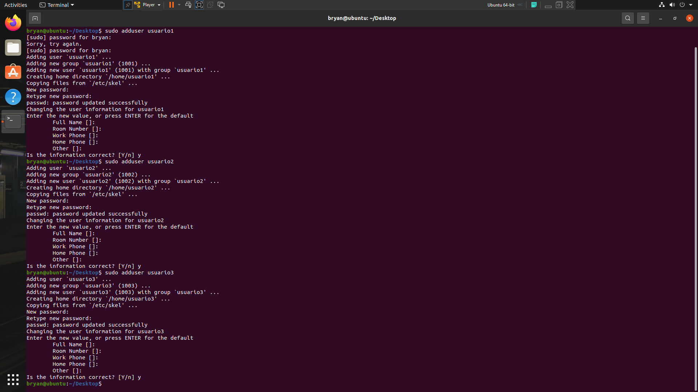
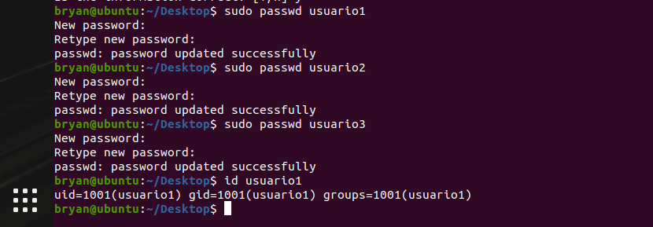
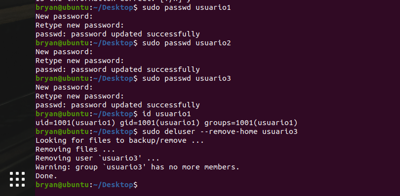
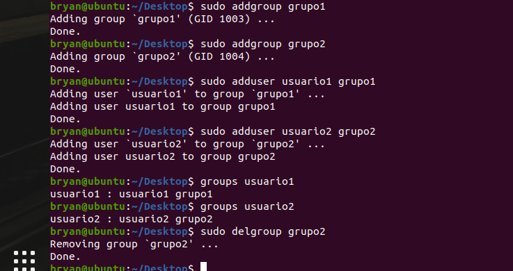
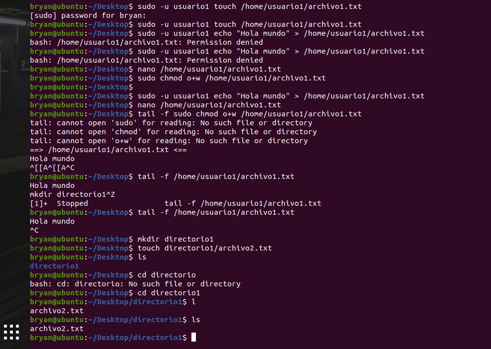
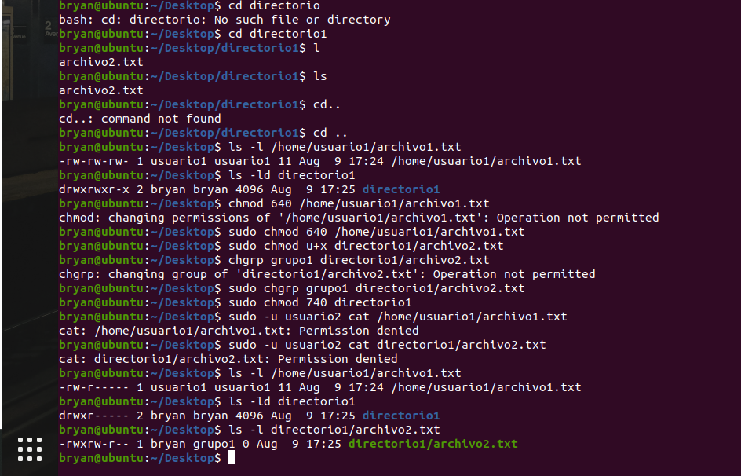

# ACTIVIDAD 3

## GESTION DE USUARIOS
### Creación de Archivos y Directorios
    
    sudo adduser usuario1
    sudo adduser usuario2
    sudo adduser usuario3

### Asignación de Contraseñas

    sudo passwd usuario1
    sudo passwd usuario2
    sudo passwd usuario3

### Información de Usuarios

    id usuario1

### Eliminación de Usuarios

    sudo deluser --remove-home usuario3

## Gestión de Grupos

### Creación de Grupos

    sudo addgroup grupo1
    sudo addgroup grupo2

###  Agregar Usuarios a Grupos
    
    sudo adduser usuario1 grupo1
    sudo adduser usuario2 grupo2

### Verificar Membresía

    groups usuario1
    groups usuario2

### Eliminar Grupo

    sudo delgroup grupo2

## Gestión de Permisos
### Creación de Archivos y Directorios

    sudo -u usuario1 touch /home/usuario1/archivo1.txt
    sudo -u usuario1 echo "Hola mundo" > /home/usuario1/archivo1.txt

### Verificar Permisos

    mkdir directorio1
    touch directorio1/archivo2.txt

### Modificar Permisos usando `chmod` con Modo Numérico
    
    ls -l /home/usuario1/archivo1.txt
    ls -ld directorio1

### Modificar Permisos usando `chmod` con Modo Simbólico
    
    sudo chmod 640 /home/usuario1/archivo1.txt

### Cambiar el Grupo Propietario
    
    sudo chmod u+x directorio1/archivo2.txt

### Configurar Permisos de Directorio
    
    sudo chgrp grupo1 directorio1/archivo2.txt

### Comprobación de Acceso
    
    sudo -u usuario2 cat /home/usuario1/archivo1.txt
    sudo -u usuario2 cat directorio1/archivo2.txt

### Verificación Final
    
    ls -l /home/usuario1/archivo1.txt
    ls -ld directorio1
    ls -l directorio1/archivo2.txt

